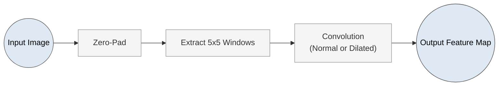

# Hard-Coded CNN Layer with NumPy



This project demonstrates how to manually implement a simple CNN-like layer using only **NumPy** and **Pillow (PIL)**—no deep learning frameworks. It includes:

- **Window extraction** (patch extraction)  
- **Zero-padding**  
- **Normal and dilated convolutions**  
- **Generator-based approach** to iterating over patches  

The main file downloads an example image and applies a manually-coded kernel (e.g., Sobel) to that image.

## Project Structure

```
.
├── cnn_layer_demo.py        # Main script
└── README.md                # This README
```

> **Note**:  
> - The sample code references a particular URL for `mandrill.tiff`.  
> - You can swap in any image you want.

## Requirements

- **Python 3.7+**  
- **NumPy**  
- **Pillow** (PIL)  
- **Requests** (to download sample image)  
- **Matplotlib**  

Install using:

```bash
pip install numpy pillow requests matplotlib
```

## How It Works

1. **Import**:
   - **Requests** downloads a test image.
   - **Pillow** handles opening and converting images into NumPy arrays.
   - **NumPy** handles the array operations.
   - **Matplotlib** is used to visualize results.

2. **Window Extraction** (`extract_window`):
   - Takes an `(x, y)` coordinate and a `window_size`, then slices out a patch from the image.  
   - Returns `None` if the requested window extends beyond the image boundaries.

3. **Zero Padding** (`zero_pad_image`):
   - Surrounds an image with a padding of zeros (black pixels) on all sides.  
   - Useful to avoid losing border pixels when extracting windows.

4. **Convolution**:
   - **Normal Convolution** (`conv_window`):
     - Does a straightforward 2D multiplication between a patch (window) and a kernel, summing over all elements.
   - **Dilated Convolution** (`dilation_conv_window`):
     - Uses a `dilation_factor` to skip pixels in the input patch (e.g., a factor of 2 means every other pixel contributes).

5. **Patch Generation** (`get_windows`):
   - A Python generator that yields `(x, y, window)` for every valid center pixel in the image.  
   - Helps with memory efficiency—only one patch is held in memory at a time.

6. **Putting It Together** (`convolve_dilation`):
   - Iterates over each patch using `get_windows`.
   - Applies either a normal or dilated convolution (depending on the function call).
   - Stores the result in an output array with the same size as the original image.

7. **Demo / `main()`**:
   - Downloads `mandrill.tiff` from a URL.
   - Converts it to grayscale (`.convert('L')`).
   - Defines a **Sobel** kernel, for example:
     ```python
     kernel = np.array([[1, 0, -1],
                        [2, 0, -2],
                        [1, 0, -1]], dtype=np.float32)
     ```
   - Calls `convolve_dilation(test_image, kernel, dilation_factor=2)` to demonstrate a dilated convolution.
   - Displays the result with Matplotlib.

## Usage

1. **Clone the repository**:
   ```bash
   git clone https://github.com/yourname/hard-coded-cnn-layer.git
   cd hard-coded-cnn-layer
   ```

2. **Install dependencies**:
   ```bash
   pip install numpy pillow requests matplotlib
   ```
   or
   ```bash
   pip install -r requirements.txt
   ```

3. **Run the demo**:
   ```bash
   python cnn_layer_demo.py
   ```
   - The script will:
     1. Download the `mandrill.tiff` image.
     2. Perform dilated convolution with a user-defined kernel.
     3. Display the convolved result in a Matplotlib window.

4. **Customize**:
   - Swap the kernel with any other (e.g., Gaussian, Laplacian).  
   - Adjust the `dilation_factor` to see how dilation affects the convolution result.  
   - Change the URL or load your own image locally.

## Contributing

- Fork the repository and submit a Pull Request.  
- Feel free to open issues for bug reports or feature requests.  

---

*Happy coding!*
